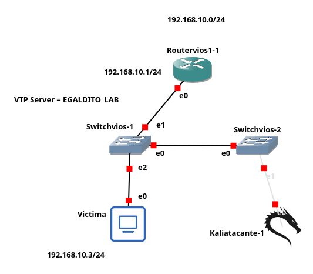

<div align="center">

# 💣 VTP Attack
### Lab EGALDITO_LAB — Ciberseguridad Ofensiva en Redes


</div>

***

## 📋 Objetivo del Laboratorio

Demostrar cómo un atacante conectado a una red que usa **VTP (VLAN Trunking Protocol)** puede inyectar mensajes VTP falsos con un número de revisión superior al del servidor, forzando a todos los switches a sincronizar y **eliminando todas las VLANs configuradas**, causando una interrupción total de la red.

***

## 🗺️ Topología de Red

<div align="center">


</div>

### Tabla de Direccionamiento

| Dispositivo | Interfaz | Modo VTP | VLAN | IP |
|:---:|:---:|:---:|:---:|:---:|
| R1 | G0/0.10 | — | 10 | `192.168.10.1/24` |
| SW1 | G0/0 | VTP Server | All | — |
| SW1 | G0/1 | VTP Server | All | — |
| SW2 | G0/0 | VTP Client | All | — |
| SW2 | G0/1 | VTP Client | Access 10 | — |
| Kali Atacante | eth0 | — | 10 | DHCP |

### Configuración VTP

| Parámetro | Valor |
|:---|:---:|
| Dominio VTP | `EGALDITO_LAB` |
| Versión VTP | `1` |
| SW1 Mode | `Server` |
| SW2 Mode | `Client` |

### Imagen topologia

***


## 🛠️ Herramienta Utilizada: Yersinia

Para este ataque se utilizó **Yersinia**, herramienta incluida por defecto en Kali Linux especializada en ataques a protocolos de Capa 2 (VTP, DTP, STP, DHCP, CDP, entre otros).

```bash
# Verificar instalación
sudo yersinia --help

# Instalar si no está disponible
sudo apt install yersinia -y
```

***

## ⚙️ Requisitos

- 🐧 Kali Linux con permisos `root`
- 🔧 Yersinia instalado: `sudo apt install yersinia -y`
- 🔌 Interfaz conectada a un puerto trunk del switch
- ⚠️ Switch con VTP en modo Server/Client sin contraseña ni VTPv3

***

## 📖 Funcionamiento del Ataque

```
┌──────────────────────────────────────────────────────────────────────┐
│                        FLUJO DEL ATAQUE VTP                          │
├──────────┬───────────────────────────────────────────────────────────┤
│ Paso 1   │ Yersinia envía VTP Summary con revisión 65535             │
│ Paso 2   │ SW1 recibe: revisión 65535 > revisión actual → acepta     │
│ Paso 3   │ SW1 sincroniza su DB → todas las VLANs eliminadas         │
│ Paso 4   │ SW2 recibe actualización de SW1 → sincroniza              │
│ Paso 5   │ Red completa sin VLANs → interrupción total               │
└──────────┴───────────────────────────────────────────────────────────┘
```

### ¿Por qué funciona?

VTP usa un **número de revisión** para sincronizar la base de datos de VLANs. Cuando un switch recibe un mensaje con revisión mayor a la que tiene, lo acepta sin autenticación (en VTPv1/v2 sin contraseña). Yersinia envía un paquete con revisión máxima y lista de VLANs vacía → todos los switches la eliminan.

***

## ▶️ Ejecución

### Modo interactivo
```bash
sudo yersinia -I
```
1. Seleccionar protocolo **VTP**
2. Presionar la **d** para reestablecer el paquete al modo predeterminado
3. Presionar **x** para ir al menu de launch attack y seleccionar la opcion que necesite. (Opciones: 1,2,3,4)
4. Cualquiera del las opciones que haya seleccionado solo pondra el ataque en cola, y yersinia espera que envie el ataque utilizando **x** nuevamente continuado con la opcion **0** para enviar el paquete vtp con el ataque

**Verificación en SW1 después del ataque:**
```bash
SW1# show vlan brief
# Resultado: solo VLAN 1 visible, todas las demás eliminadas ✔

SW1# show vtp status
# Configuration Revision: número muy alto (inyectado por Yersinia)
```

***

## 🛡️ Contramedidas y Mitigación

> 📄 Ver comandos completos en: [`Mitigacion/SW1-VTPSERVER.ios`](Mitigacion/SW1-VTPSERVER.ios)

| # | Opción | Medida | Protección |
|:---:|:---|:---|:---|
| 1 | **Recomendada para lab** | `vtp mode transparent` | Ignora todos los mensajes VTP externos |
| 2 | **Recomendada producción** | VTPv3 + contraseña | Autentica con MD5 mejorado, bloquea revisión |
| 3 | **Mínima** | `vtp password Cisco123` | Descarta mensajes VTP sin contraseña correcta |

***

<div align="center">

**EGALDITO_LAB** -  Ciberseguridad Ofensiva en Redes -  2025-0704

</div>
